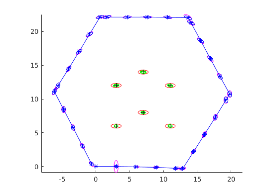
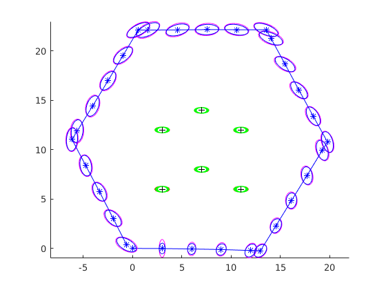
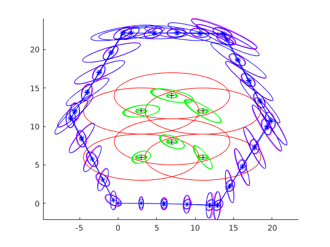

# 16-833 SLAM Homework 2
# Joe Phaneuf ( andrew id: jphaneuf)
# March 2 2018

# Introduction

# 1.
## a.
For a state P and control input u , our robot's positions at the next time step can be described like so :
$$
P = 
\begin{bmatrix}
x \\
y \\
\theta
\end{bmatrix}
=
\begin{bmatrix}
p_{1} \\
p_{2} \\
p_{3}
\end{bmatrix}
$$

$$
u = 
\begin{bmatrix}
d_{t}\\
alpha_{t}
\end{bmatrix}
=
\begin{bmatrix}
    u_{1} \\
    u_{2}
\end{bmatrix}
$$

$$
\bar{P} = f ( P , u ) =
\begin{bmatrix}
p_{1} + u_{1} cos ( p_{3} ) \\
p_{2} + u_{1} sin ( p_{3} ) \\
p_{3} + u_{2}
\end{bmatrix}
$$

## b.
Say that our estimate of uncertainty at time t is 3x3 covariance matrix P. We define our our process noise covariance matrix Q as  
$$
Q=
\begin{bmatrix}
\sigma_{x}^{2} & 0 & 0 \\
0 & \sigma_{y}^{2} & 0 \\
0 & 0 & \sigma_{\alpha}^{2}
\end{bmatrix}
$$

To predict unceartainty at time t+1 , we project P forwards in time with state transition matrix F, then add process noise Q.
$$
P_{t+1} = F P_{t} F^{T} + Q
$$

Alternatively, we can ( and will ) create a 2x2 covariance matrix in control space.
$$
controlCov =
\begin{bmatrix}
\sigma_{d_{t}}^{2} & 0 \\
0 & \sigma_{\alpha_{t}}^{2} 
\end{bmatrix}
$$

controlCov can then be projected into state space using the Jacobian 

$$
F_{u} = \frac { \partial f ( \bar { P } , u ) } { \partial u }
$$

Resulting in a covariance prediction at time t+1:
$$
P_{t+1} = F P_{t} F^{T} + F_{u} controlCov F_{u}^{T}
$$

## c. 
Given a state estimate $p_{t}$ and a measurement $z$ , we find a landmark's global position $\bar{L}$ as follows.
$$
z = \begin{bmatrix}
    r     \\
    \beta 
    \end  {bmatrix}
=   \begin{bmatrix}
    z_{1} \\
    z_{2} 
    \end  {bmatrix}
$$
$$
\bar{L} = 
\begin{bmatrix}
l_{x}\\
l_{y}\\
\end{bmatrix}
= h ( p_{t} , z) =
\begin{bmatrix}
x + r cos ( \theta + \beta ) \\
y + r sin ( \theta + \beta )
\end{bmatrix} =
\begin{bmatrix}
p_{1} + z_{1} cos ( p_{3} + z_{2} ) \\
p_{2} + z_{1} sin ( p_{3} + z_{2} )
\end{bmatrix}
$$

The measurement uncertainty is characterized by covariance matrix R

$$
R =
diag (
\begin{matrix}
\sigma_{\beta 1}^{2} &
\sigma_{r 1}^{2} & 
\end{matrix}
)
$$

We can project the measurement covariance matrix into state space using the the landmark position function $\bar{L}$ defined in c and a measurement vector $z$.  
$$
V = \frac { \partial \bar { L } ( \bar { P } , z ) } { \partial z }
$$
$$
COV_{landmark} = V R V^{T}
$$

We then say we estimate the position of a landmark to be $\bar{L}$ with covariance $COV_{landmark}$

## d.
For some state $p$ we estimate the angle and range measurements 
$$
h ( p ) =
\begin{bmatrix}
\beta \\
r 
\end{bmatrix}
=
\begin{bmatrix}
wrapToPi( atan2 ( \frac { l_{y} - y } { l_{x} - x }  ) - \theta ) \\
\sqrt { ( l_{y} - y )^{2} + ( l_{x} - x)^{2} ) } 
\end{bmatrix}
$$

With covariance R ( defined in c. )

##e.

$$
H = \frac { \partial h } {\partial p}
= \begin{bmatrix}
\frac { \partial h_{1} } { \partial p_{1} } & \frac { \partial h_{1} } { \partial p_{2} } & \frac { \partial h_{1} } { \partial p_{3} } \\
 & & \\
\frac { \partial h_{2} } { \partial p_{1} } & \frac { \partial h_{2} } { \partial p_{2} } & \frac { \partial h_{2} } { \partial p_{3} }
  \end{bmatrix}
$$
$$
=
\begin{bmatrix}
\frac {1} { (l_{x} - x )^{2} + (l_{y} - y )^{2} ) } &
\frac {-1} { 1 + \frac {  (l_{y} - y )^{2} ) } { (l_{x} - x )^{2} } } &
-1 \\
\frac {-2 ( l_{x} - x ) } {\sqrt { (l_{x} - x )^{2} + (l_{y} - y )^{2} } } &
\frac {-2 ( l_{y} - y ) } {\sqrt { (l_{x} - x )^{2} + (l_{y} - y )^{2} } } &
0 
\end{bmatrix}
$$

##f.
$$
H = \frac { \partial h } {\partial l}
= \begin{bmatrix}
\frac { \partial h_{1} } { \partial l_{1} } & \frac { \partial h_{1} } { \partial l_{2} } \\
\frac { \partial h_{2} } { \partial l_{1} } & \frac { \partial h_{2} } { \partial l_{2} }
  \end{bmatrix}
=
\begin{bmatrix}
\frac {-1} { (l_{x} - x )^{2} + (l_{y} - y )^{2} ) } &
\frac {1} { 1 + \frac {  (l_{y} - y )^{2} ) } { 1 + (l_{x} - x )^{2} } } \\
\frac {2 ( l_{x} - x ) } {\sqrt { (l_{x} - x )^{2} + (l_{y} - y )^{2} } } &
\frac {2 ( l_{y} - y ) } {\sqrt { (l_{x} - x )^{2} + (l_{y} - y )^{2} } } 
\end{bmatrix}
$$

#2

## a.
There are 6 [ $\beta_{i} r_{i}$ ] pairs per line in the data file, each pair corresponding to a landmark.

## b.  
\

Figure 1: EKF robot and landmark state estimates
\ 
  
## c.  

Each individual element of our state has an associated uncertainty (the diagonals of our covariance matrix). But, more information is better than less, and the EKF uses the covariances of the whole state together as a measure of how good each of our predictions is. The predicted covariance is used to calculate the "Kalman gain", which intuitively is a scale of how much we trust our prediction versus how much we trust our new measurements.  If the predicted covariance is large we form a state estimate that favors the latest measurement, and vice versa. Combining information this way yields a more robust state estimate than tracking robot trajectory and landmarks separately.

## d.  

\
  
  
Figure 2: EKF state estimates with ground truth landmarks ( black markers )
  
The euclidean distances of our landmark estimates to known landmark positions is :
$$
\begin{bmatrix}
0.0110\\
0.0038\\
0.0058\\
0.0041\\
0.0115\\
0.0040\\
\end{bmatrix}
$$

The Mahalanobis distances are 
$$
\begin{bmatrix}
2.3780 \\
1.7060 \\
0.2345 \\
1.5803 \\
2.3888 \\
1.7117 \\
\end{bmatrix}
$$

Where the Euclidean distance is the physical distance of each landmark estimate from groundtruth, and Mahalanobis distances are measures of how far each landmark estimate is from the mean of the groundtruth estimates.

#3
## a.
Additionally, when setting the initial value for the full covariance matrix P (line 49 in EKF_SLAM.m) an assumption is made regarding certain cross-covariances that is not necessarily correct. Can you point out what that is?

The initial zero off-diagonal terms in the state covariance matrix become non-zero as we apply updates. Each prediction and update involves projecting control and measurement uncertainty into state space and incorporating those uncertainties into our state covariance estimate, with the effect of creating uncertainty of each state element relative to other state elements.

To initialize the state covariance , we assume that each state element's variance is unrelated to all other state elements (diagonal covariance matrix). This is not actually true, as we form the intitial estimates based on measurements from the same position, but EKF adapts quickly enough to make this assumption not matter too much.

## b.
The following standard deviations have been used for tests thus far:  
sigx = 0.25;  
sigy = 0.1;  
sigalpha = 0.1;  
sigbeta = 0.01;  
sigr = 0.08;  
sigdt = 0.1;  

For experimentation's sake, make sigbeta = 0.1; sigr = 0.8. The result is shown in Figure 3. The state estimate means appear to track the same as in previous runs, however the covariance matrices are significantly larger, meaning our certainty of our estimate at each time step has been diminished.

\
  
  
Figure 3: EKF increased measurement uncertainty
 
Next, we revert sigbeta and sigr to original values, and set robot pose standard deviations sigx = 2.5;  sigy = 1;  sigalpha = 1;  

The result is shown in Figure 4. The state estimate means still look good, but the covariances are even larger than the previous run.

\
  
  
Figure 4: EKF increased pose uncertainty

## c.
In the case where we want to use EKF slam with many landmarks, the required compute power makes the approach used in the project too slow to work in real time.
One option to address this issue would be to keep a fixed number of landmarks in the EKF at any given time, and substitute new landmarks in and out of the state estimate as they are identified by a perception subsystem. This presents a few issues in terms of resetting covariances and estimates, but is conceivable possible.
There may also be some sparse matrix operations that can be used for some steps.
